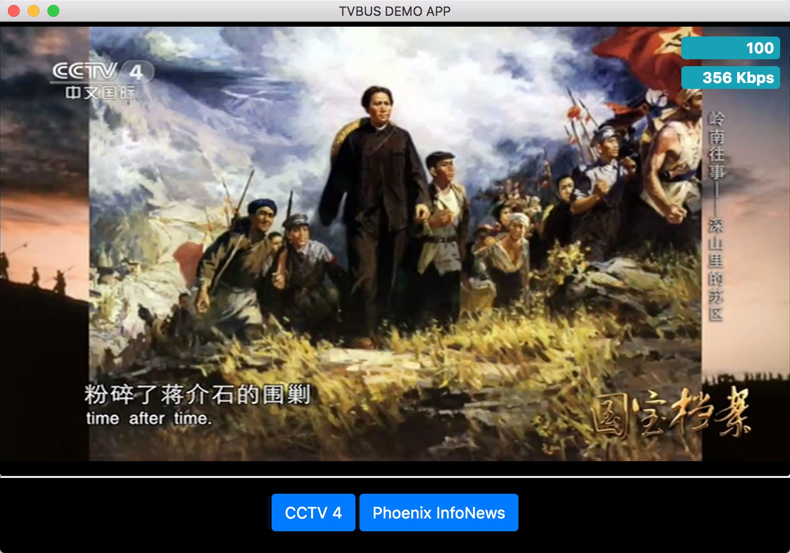

tvbus.pc.demo
=================

tvbus.pc.demo is a demo app for tvbus.pc based on Electron.

### QuickStart
-----
* Install latest Node.js
* Clone this repository, git clone https://github.com/binstreamio/tvbus.pc.demo.git tvbus.pc.demo
* cd tvbus.pc.demo && npm install
* npm start
* done

### References
-----
1. https://github.com/nodejs/node -- Node.js JavaScript runtime.
1. https://github.com/electron/electron -- Build cross platform desktop apps with JavaScript, HTML, and CSS.
1. https://github.com/clappr/clappr -- An extensible media player for the web.
1. https://github.com/binstreamio/tvbus.pc -- A live streaming SDK based on P2P technology.

### More info
----
www.binstream.io